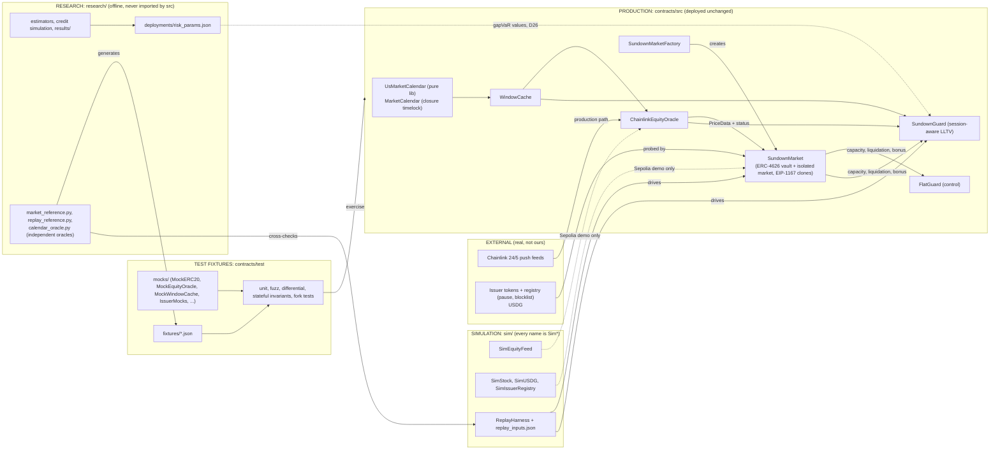

# Architecture

Sundown is a session-aware credit-risk layer and an isolated lending market for tokenized-stock collateral. The market contains no session logic; all of it sits behind a guard interface and a calendar-aware oracle adapter. The diagram separates what ships (production), what only exists to test it (fixtures), what stands in for chains and feeds that do not exist on the test network (simulation), and the offline analysis that produced the parameters (research).

Solid arrows are code dependencies or data flow in production. Dotted arrows exist only in the Arbitrum Sepolia demonstration or as parameter provenance.

## What is where (truth in labeling)

| Directory | Status | Rule |
|---|---|---|
| `contracts/src` | Production | The only code claimed as the product. No chain addresses (config lives in `deployments/*.json`); imports only OpenZeppelin besides itself. |
| `contracts/test/mocks`, `contracts/test/fixtures` | Test fixtures | Never deployed; used to prove behavior against hostile or controllable inputs. |
| `contracts/script` | Deployment tooling | Deploys production code plus the `sim/` fixtures on Arbitrum Sepolia only. |
| `sim/` | Simulation | Test tokens, a keeper-published price feed and the replay harness. Named `Sim*`, documented as simulation; nothing in `src` imports it. |
| `research/` | Offline analysis | Produces parameters and independent reference models; raw vendor data is git-ignored. |
| `deployments/` | Configuration | Real-chain read-only targets (`robinhood-mainnet.json`), the research parameter set, and the Sepolia deployment record (`421614.json`). |

## Trust boundaries

- **The market is bounded against its guard and oracle.** Borrow capacity is `min(guard, collateralValue x LLTV)`; the liquidation bonus is capped, the close factor and the non-worsening rule are enforced by the market, and the guard address is fixed at market creation. A malicious guard can freeze borrowing and trigger bounded liquidations; it cannot move funds.
- **The oracle adapter classifies, it does not decide.** It reports the price with a status (`Fresh`, `ScheduledBlind`, `Reopening`, `Stale`, `Invalid`, `CorporateAction`, `SequencerDown`) and a haircut; the market refuses `Invalid`, `CorporateAction` and `SequencerDown`, and the guard decides on the rest.
- **The issuer is outside the trust boundary.** Pauses, blocklisting and `adminBurn` of the collateral token cannot be prevented; the market detects them with permissionless probes and halts. Repay is never blockable by the guard or by a halt.
- **Time is calendar-derived.** The guard measures the pre-window horizon from the window start supplied by the shared `WindowCache`; it never converts wall-clock time, so daylight-saving days need no special case.

Details: `MARKET_DESIGN.md`, `GUARD_DESIGN.md`, `CALENDAR_NOTES.md`, `THREAT_MODEL.md`.
